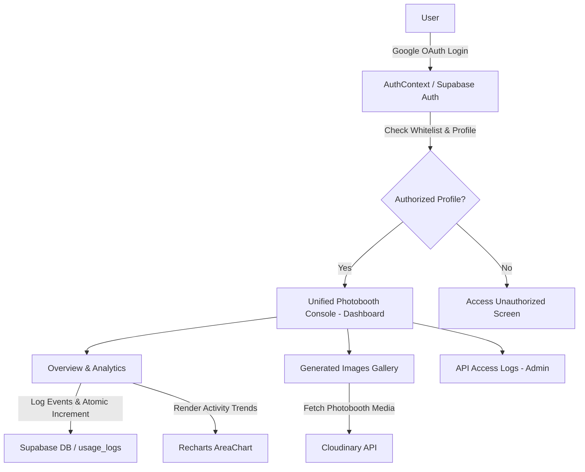

# Cairo Airport AI Photobooth Dashboard

An administrative and analytics dashboard for managing the Cairo Airport AI Photobooth project, tracking cumulative generation usage, managing global configurations, and inspecting Cloudinary media assets.

---

## 🚀 Technology Stack

| Layer | Technology / Package | Description |
| :--- | :--- | :--- |
| **Framework** | Next.js 16 (App Router), React 19, TypeScript | Core application framework and routing |
| **Styling & UI** | Tailwind CSS v3, PostCSS, `clsx`, `tailwind-merge`, Lucide React | Modern responsive UI, minimizable sidebar layout, and icon system |
| **Backend & Auth** | Supabase (`@supabase/supabase-js`, `@supabase/auth-helpers-nextjs`) | Google OAuth, invite-only email whitelisting (`allowed_users`), user profiles, and database |
| **Media Engine** | Cloudinary API | Tag-based photobooth image fetching (`cairo-airport-photobooth`), metadata inspection, and asset management |
| **Analytics & Data** | Recharts & PostgreSQL RPC | Interactive graphs for generation activity trends and atomic total usage counter |

---

## 🏗️ Architecture & Data Flow



### Key Modules & Workflow

1. **Authentication & Access Control (`components/AuthContext.tsx`)**:
   - Manages user sessions via Supabase Auth with Google OAuth integration.
   - Enforces invite-only email whitelisting (`allowed_users` table). Any authorized user automatically gains access to the photobooth console.
   - Role-based permissions (`ADMIN` vs `REGULAR`).

2. **Minimizable Navigation & Sidebar (`components/ClientRootLayout.tsx`)**:
   - Sleek minimizable sidebar layout with smooth collapse/expand transitions.
   - Menu items: **Dashboard** (`/`), **User Management** (`/users`), **Global Settings** (`/settings`).

3. **Unified Photobooth Dashboard (`app/page.tsx`)**:
   - **Overview & Analytics**: Cumulative Total Generations stat card, Recharts generation activity area chart (7D, 30D, 90D, and custom date range picker), API simulation controls, and Cloudinary settings.
   - **Generated Images Gallery**: Real-time Cloudinary image feed, sorting (Newest/Oldest), selection mode & bulk download, and detailed image metadata inspection modal.
   - **API Access Logs**: Real-time generation event log stream (Admin only).

4. **Generation API (`/api/projects/[id]/generate`)**:
   - Receives generation events, writes to `usage_logs`, and invokes `increment_project_usage` RPC to update cumulative counts atomically.

---

## 🛠️ Getting Started

### Prerequisites

- Node.js 18+
- npm

### Environment Setup

Create a `.env.local` file in the root directory:

```env
NEXT_PUBLIC_SUPABASE_URL=your_supabase_url
NEXT_PUBLIC_SUPABASE_ANON_KEY=your_supabase_anon_key
NEXT_PUBLIC_CLOUDINARY_CLOUD_NAME=your_cloudinary_cloud_name
NEXT_PUBLIC_CLOUDINARY_API_KEY=your_cloudinary_api_key
CLOUDINARY_API_SECRET=your_cloudinary_api_secret
```

### Installation & Development

```bash
# Install dependencies
npm install

# Run development server (runs on port 4000)
npm run dev
```

Open [http://localhost:4000](http://localhost:4000) in your browser.

---

## 📦 Scripts

- `npm run dev`: Starts the Next.js development server on port 4000.
- `npm run build`: Builds the production bundle.
- `npm run start`: Starts the production server.
- `npm run lint`: Runs ESLint check.
