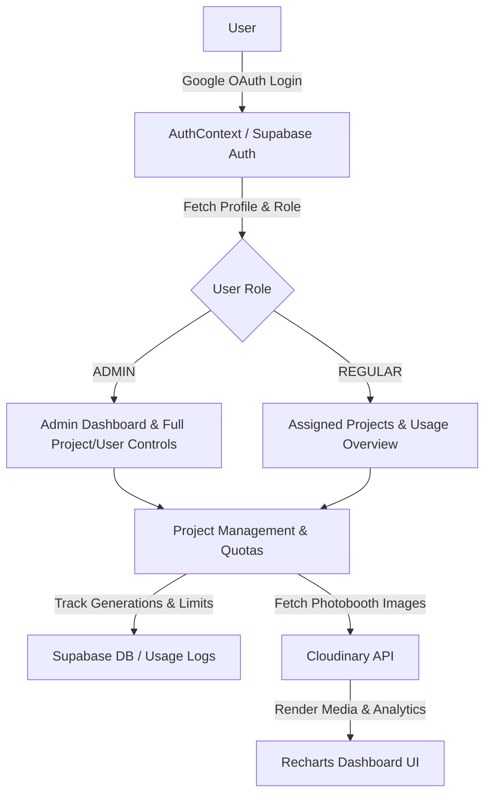

# Cairo Airport AI Photobooth Dashboard

An administrative and analytics dashboard for managing the Cairo Airport AI Photobooth project, tracking generation quotas, managing project configurations, and inspecting Cloudinary media assets.

---

## 🚀 Technology Stack

| Layer | Technology / Package | Description |
| :--- | :--- | :--- |
| **Framework** | Next.js 16 (App Router), React 19, TypeScript | Core application framework and routing |
| **Styling & UI** | Tailwind CSS v3, PostCSS, `clsx`, `tailwind-merge`, Lucide React | Modern responsive UI, dynamic utility styling, and icons |
| **Backend & Auth** | Supabase (`@supabase/supabase-js`, `@supabase/auth-helpers-nextjs`) | Google OAuth, session management, user profiles, RBAC, and database |
| **Media Engine** | Cloudinary SDK | Tag-based photobooth image fetching, metadata inspection, and asset management |
| **Analytics & Data** | Recharts | Interactive graphs for daily generation metrics and project usage logs |

---

## 🏗️ Architecture & Data Flow



### Key Modules & Workflow

1. **Authentication & Access Control (`components/AuthContext.tsx`)**:
   - Manages user sessions via Supabase Auth with Google OAuth integration.
   - Enforces Role-Based Access Control (`ADMIN` vs `REGULAR`) and attaches assigned project permissions (`assignedProjectIds`).

2. **Project & Quota Tracking (`types.ts`, `store.ts`)**:
   - Tracks generation limits (`dailyLimit`, `currentGenerations`) and status (`active`, `paused`, `exhausted`).
   - Associates project-specific Cloudinary credentials (Cloud Name, API Key, Tags).

3. **Cloudinary Asset Pipeline (`services/cloudinaryService.ts`)**:
   - Connects to Cloudinary to retrieve tagged photobooth images and metadata (`public_id`, dimensions, format, tags, creation timestamp).

4. **Analytics & Visualization (`app/page.tsx`)**:
   - Visualizes usage logs and generation trends over time using `Recharts`.

---

## 🛠️ Getting Started

### Prerequisites

- Node.js 18+
- npm

### Environment Setup

Create a `.env.local` file in the root directory:

```env
NEXT_PUBLIC_SUPABASE_URL=your_supabase_url
NEXT_PUBLIC_SUPABASE_ANON_KEY=your_supabase_anon_key
NEXT_PUBLIC_CLOUDINARY_CLOUD_NAME=your_cloudinary_cloud_name
NEXT_PUBLIC_CLOUDINARY_API_KEY=your_cloudinary_api_key
CLOUDINARY_API_SECRET=your_cloudinary_api_secret
```

### Installation & Development

```bash
# Install dependencies
npm install

# Run development server (runs on port 4000)
npm run dev
```

Open [http://localhost:4000](http://localhost:4000) in your browser.

---

## 📦 Scripts

- `npm run dev`: Starts the Next.js development server on port 4000.
- `npm run build`: Builds the production bundle.
- `npm run start`: Starts the production server.
- `npm run lint`: Runs ESLint check.
