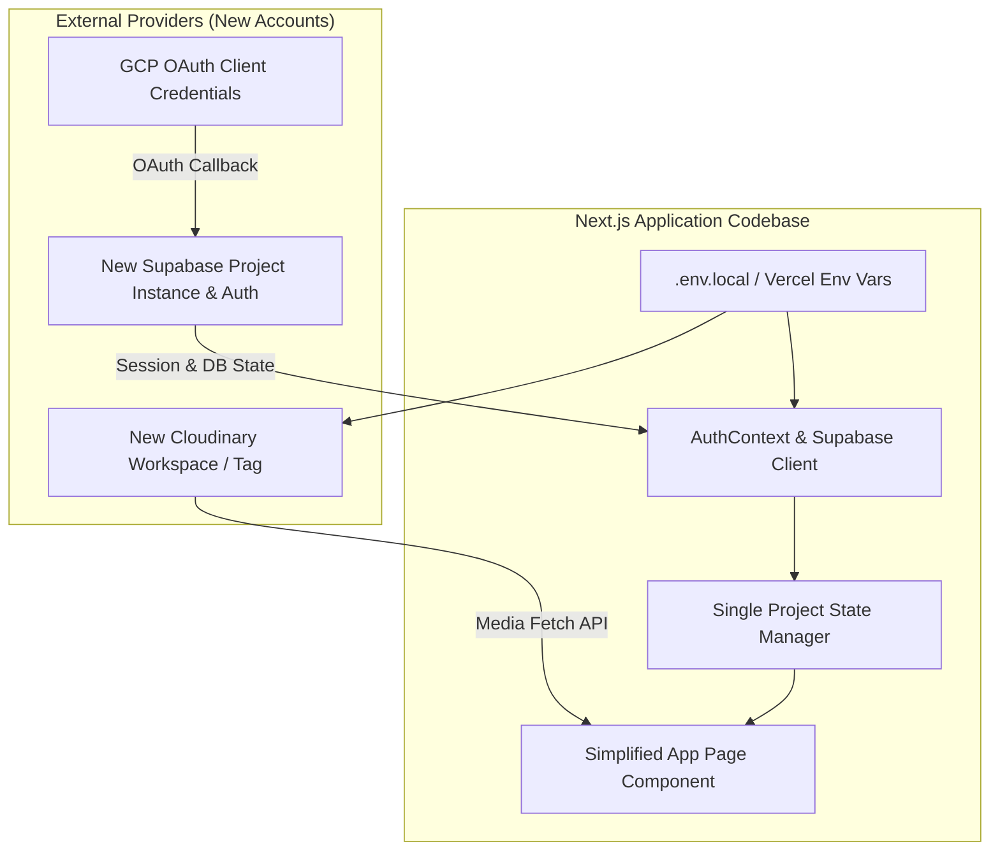

# Implementation Plan: Single-Project Dashboard & Full Account Migration

**Feature Branch**: `001-single-project-migration`  
**Created**: 2026-08-05  
**Feature Spec**: [spec.md](./spec.md)  

---

## Technical Context

- **Framework**: Next.js 16 (App Router), React 19, TypeScript.
- **Backend & DB**: Supabase (PostgreSQL + Auth with Google OAuth).
- **Media Engine**: Cloudinary API with tag-based filtering.
- **Hosting**: Vercel deployment platform.
- **Migration Target**: Brand-new Supabase project, brand-new GCP OAuth client credentials, brand-new Cloudinary workspace, updated Vercel environment variables.

---

## Architecture & System Changes

---

## Proposed Changes

### Component 1: Database & Provider Migration Scripts

#### [NEW] `supabase/schema.sql`
- Contains complete DDL statements for `allowed_users`, `profiles`, `projects`, `usage_logs`, and `global_settings` tables on the new Supabase project.
- Row Level Security (RLS) policies for invite-only email whitelisting (`allowed_users`) and RBAC user permissions.
- Trigger function (`handle_new_user`) to automatically map Google OAuth sign-in users to whitelisted roles.
- Default seed insert for the single Cairo Airport Photobooth project and global configuration.

### Component 2: Configuration & Environment Setup

#### [MODIFY] `.env.local` / Environment Configuration Guide
- `NEXT_PUBLIC_SUPABASE_URL`: Point to new Supabase project URL.
- `NEXT_PUBLIC_SUPABASE_ANON_KEY`: Point to new Supabase anon key.
- `NEXT_PUBLIC_CLOUDINARY_CLOUD_NAME`: Point to new Cloudinary workspace name.
- `NEXT_PUBLIC_CLOUDINARY_API_KEY`: Point to new Cloudinary API key.
- `CLOUDINARY_API_SECRET`: Point to new Cloudinary API secret.

### Component 3: Codebase Refactoring & UI Simplification

#### [MODIFY] `types.ts`
- Maintain clean TypeScript contracts for single project scope.

#### [MODIFY] `store.ts`
- Adapt state management to focus on a single active project configuration.

#### [MODIFY] `app/page.tsx`
- Remove `recharts` charts and multi-project selection controls.
- Simplify layout into a unified single-project operational dashboard (Status badge, Quota counter, Quota editor, Media gallery).

#### [MODIFY] `package.json`
- Optional cleanup of unused dependencies if charts are completely removed.

---

## Verification Plan

### Automated Tests
- Type checking: `npx tsc --noEmit`
- Build verification: `npm run build`

### Manual Verification Scenarios
1. **Google Auth Login**: Log in via Google OAuth on new Supabase backend and verify session resolution.
2. **Quota Updates**: Modify daily generation limit and toggle active/paused status; verify persistence in the new database.
3. **Media Feed**: Confirm photobooth media images are fetched and displayed properly from the new Cloudinary account.
