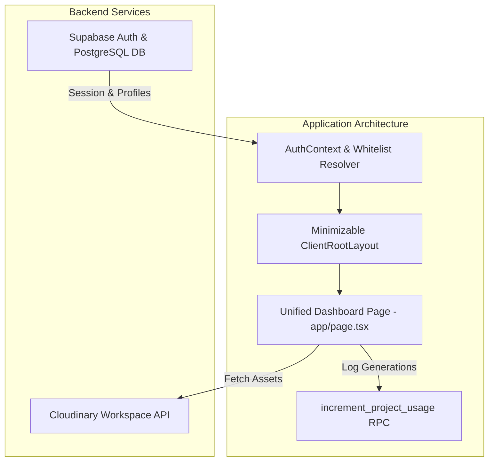

# Implementation Plan: Cairo Airport Photobooth Dashboard Migration & Consolidation

**Feature Branch**: `001-single-project-migration`  
**Created**: 2026-08-05  
**Updated**: 2026-08-06  
**Feature Spec**: [spec.md](./spec.md)  

---

## Technical Context

- **Framework**: Next.js 16 (App Router), React 19, TypeScript.
- **Backend & DB**: Supabase (PostgreSQL + Auth with Google OAuth).
- **Media Engine**: Cloudinary API with tag-based filtering (`cairo-airport-photobooth`).
- **Hosting**: Vercel deployment platform.

---

## Architecture & System Changes

---

## Proposed & Completed Changes

### Component 1: Database Schema & Triggers

#### [NEW] `supabase/schema.sql`
- Tables: `allowed_users`, `profiles`, `projects`, `usage_logs`, `global_settings`.
- RLS Policies: Whitelist reading/editing, profile auto-cleanup trigger (`handle_allowed_user_removed`), atomic RPC (`increment_project_usage`).

### Component 2: Layout & Navigation

#### [MODIFY] `components/ClientRootLayout.tsx`
- Minimizable/collapsible sidebar (`w-64` <-> `w-20`) with smooth transition effects.
- Clean menu items: **Dashboard** (`/`), **User Management** (`/users`), **Global Settings** (`/settings`).

### Component 3: Consolidated Photobooth Console

#### [MODIFY] `app/page.tsx`
- Embedded full photobooth console directly on main dashboard.
- Overview & Analytics: Total usage stat card, Recharts activity area chart, date range pickers, API simulation.
- Generated Images Gallery: Live Cloudinary image feed, sorting (Newest/Oldest), multi-select bulk download, metadata inspector modal.
- Real-time API Logs stream (Admin only).

---

## Verification Plan

### Automated Tests
- Type checking: `npx tsc --noEmit`

### Manual Verification Scenarios
1. **Google Auth & Whitelist**: Verify login with whitelisted email vs un-whitelisted email blocking.
2. **Total Usage & Simulation**: Click "Simulate Generation" and verify `total_usage` counter increments atomically.
3. **Media Gallery**: Confirm Cloudinary images load, sort, bulk download, and inspect modal opens cleanly.
