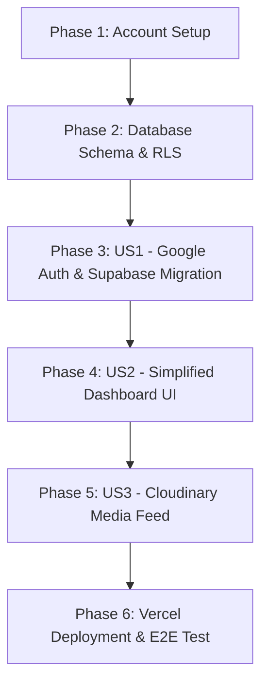

# Tasks: Single-Project Dashboard & Full Account Migration

**Feature Directory**: `specs/001-single-project-migration`  
**Plan**: [plan.md](./plan.md)  
**Spec**: [spec.md](./spec.md)  

---

## Phase 1: Setup & Account Provisioning

- [x] T001 Provision new Supabase project instance and retrieve API URL and Anon Key
- [x] T002 Configure Google Cloud Platform (GCP) OAuth 2.0 credentials (Client ID & Client Secret) with authorized redirect URI `https://<supabase-ref>.supabase.co/auth/v1/callback`
- [x] T003 Configure Google Auth provider in Supabase Dashboard with GCP Client ID and Client Secret
- [x] T004 Provision new Cloudinary workspace and configure media upload tags for the Cairo Airport Photobooth project
- [x] T005 Update local environment configuration file [.env.local](file:///d:/5DVR/Projects/Cairo-Airport-Photobooth/Project/Cairo-Airport-Team-Projects/Cairo-Airport-Photobooth-Dashboard/.env.local) with new Supabase and Cloudinary keys

---

## Phase 2: Foundational Database Setup

- [x] T006 Create Supabase database migration DDL schema file [supabase/schema.sql](file:///d:/5DVR/Projects/Cairo-Airport-Photobooth/Project/Cairo-Airport-Team-Projects/Cairo-Airport-Photobooth-Dashboard/supabase/schema.sql) containing `allowed_users`, `profiles`, `projects`, `usage_logs`, and `global_settings` tables and RLS security policies
- [x] T007 Execute database DDL schema and seed initial Cairo Airport Photobooth project record in new Supabase SQL Editor
- [x] T008 [P] Verify Supabase Auth client initialization in [utils/supabase.ts](file:///d:/5DVR/Projects/Cairo-Airport-Photobooth/Project/Cairo-Airport-Team-Projects/Cairo-Airport-Photobooth-Dashboard/utils/supabase.ts)

---

## Phase 3: User Story 1 - Backend & Auth Migration to New Provider (Priority: P1)

> **Goal**: Ensure user login, invite-only email whitelisting (`allowed_users`), and session persistence resolve seamlessly against the new Supabase backend and Google OAuth setup.
> **Independent Test**: Sign in with Google on local/staging URL, confirm whitelisted user session creation and profile retrieval from new Supabase database.

- [ ] T009 [US1] Verify Google OAuth redirect flow and whitelisted profile resolution in [components/AuthContext.tsx](file:///d:/5DVR/Projects/Cairo-Airport-Photobooth/Project/Cairo-Airport-Team-Projects/Cairo-Airport-Photobooth-Dashboard/components/AuthContext.tsx)
- [ ] T010 [US1] Ensure login page invite-only messaging and redirect handling work in [app/login/page.tsx](file:///d:/5DVR/Projects/Cairo-Airport-Photobooth/Project/Cairo-Airport-Team-Projects/Cairo-Airport-Photobooth-Dashboard/app/login/page.tsx)
- [ ] T010b [US1] Verify email whitelist management interface in [app/users/page.tsx](file:///d:/5DVR/Projects/Cairo-Airport-Photobooth/Project/Cairo-Airport-Team-Projects/Cairo-Airport-Photobooth-Dashboard/app/users/page.tsx)

---

## Phase 4: User Story 2 - Simplified Single-Project Dashboard View (Priority: P2)

> **Goal**: Refactor the main dashboard UI to focus exclusively on the single photobooth project, removing multi-project selectors and complex charts.
> **Independent Test**: Open main dashboard page, verify single project status badge, quota progress bar, and quota edit form render without multi-project dropdowns or charting errors.

- [ ] T011 [US2] Update project state interfaces and type definitions for single project scope in [types.ts](file:///d:/5DVR/Projects/Cairo-Airport-Photobooth/Project/Cairo-Airport-Team-Projects/Cairo-Airport-Photobooth-Dashboard/types.ts)
- [ ] T012 [US2] Adapt state management helper functions for single active project in [store.ts](file:///d:/5DVR/Projects/Cairo-Airport-Photobooth/Project/Cairo-Airport-Team-Projects/Cairo-Airport-Photobooth-Dashboard/store.ts)
- [ ] T013 [US2] Refactor main dashboard page [app/page.tsx](file:///d:/5DVR/Projects/Cairo-Airport-Photobooth/Project/Cairo-Airport-Team-Projects/Cairo-Airport-Photobooth-Dashboard/app/page.tsx) to remove `recharts` analytics and multi-project selection controls in favor of a unified single-project card

---

## Phase 5: User Story 3 - Single-Project Photobooth Media Feed (Priority: P3)

> **Goal**: Display photobooth generated media assets fetched from the new Cloudinary account matching the single project tag.
> **Independent Test**: View the media gallery section on the dashboard and confirm images load cleanly from Cloudinary.

- [ ] T014 [P] [US3] Verify Cloudinary SDK fetching and image tag resolution in [services/cloudinaryService.ts](file:///d:/5DVR/Projects/Cairo-Airport-Photobooth/Project/Cairo-Airport-Team-Projects/Cairo-Airport-Photobooth-Dashboard/services/cloudinaryService.ts)
- [ ] T015 [US3] Render photobooth media gallery feed for the single project tag in [app/page.tsx](file:///d:/5DVR/Projects/Cairo-Airport-Photobooth/Project/Cairo-Airport-Team-Projects/Cairo-Airport-Photobooth-Dashboard/app/page.tsx)

---

## Phase 6: Polish, Deployment & Verification

- [ ] T016 Update production environment variables on Vercel deployment project settings
- [ ] T017 Run TypeScript type validation `npx tsc --noEmit` and build test `npm run build`
- [ ] T018 Execute end-to-end verification of Google OAuth login, quota management, and Cloudinary media feed on Vercel live URL

---

## Dependency Graph & Execution Strategy

### Suggested MVP Scope
- **MVP**: Phase 1 through Phase 4 (Setup accounts, schema, Google OAuth login, and simplified single-project dashboard).
